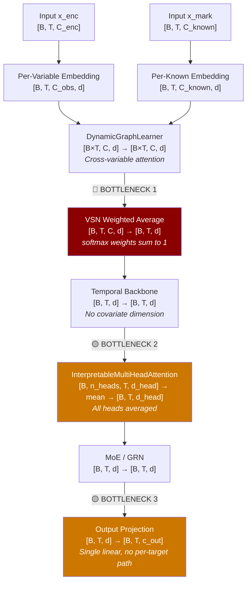

# Independent Scan: Bugs, Inefficiencies & Information Loss

Fresh scan of [TemporalFusionTransformer.py](file:///c:/workspace/Time-Series-Library-ForkWorkspace/models/TemporalFusionTransformer.py) (1161 lines), [TemporalFusion_layers.py](file:///c:/workspace/Time-Series-Library-ForkWorkspace/layers/TemporalFusion_layers.py) (587 lines), and [DynamicGraph.py](file:///c:/workspace/Time-Series-Library-ForkWorkspace/layers/DynamicGraph.py) (112 lines).

---

## Part 1: Implementation Bugs

### 🔴 Bug 1: In-Place `mul_` in InterpretableMultiHeadAttention

[Line 360](file:///c:/workspace/Time-Series-Library-ForkWorkspace/models/TemporalFusionTransformer.py#L360):

```python
attention_score.mul_(self.scale)  # in-place!
```

`mul_` modifies the tensor in-place. This is fragile under gradient checkpointing (`use_reentrant=False`) because the forward function is re-executed during backward. While the tensor is freshly created by `torch.matmul`, PyTorch's versioncheck mechanism can still flag in-place modifications on tensors that participate in the computation graph. The [PositionalMultiHeadAttention](file:///c:/workspace/Time-Series-Library-ForkWorkspace/layers/TemporalFusion_layers.py#72-190) class correctly uses `* self.scale` (out-of-place) — this should match.

```diff
-attention_score.mul_(self.scale)
+attention_score = attention_score * self.scale
```

### 🟡 Bug 2: `last_hidden_state` Removed But [out](file:///c:/workspace/Time-Series-Library-ForkWorkspace/layers/TemporalFusion_layers.py#610-629) After Loop Could Reference Stale Value

In `TemporalFusionDecoder.forward()` line 814:

```python
decoder_hidden = out[:, -self.pred_len:, :]
```

If **all** layers are skipped by stochastic depth (theoretically impossible because layer 0 is protected, but the code doesn't assert this invariant), [out](file:///c:/workspace/Time-Series-Library-ForkWorkspace/layers/TemporalFusion_layers.py#610-629) would be the concatenation from the last skipped layer. With layer 0 always executing, this is safe in practice, but there's no `assert` ensuring [out](file:///c:/workspace/Time-Series-Library-ForkWorkspace/layers/TemporalFusion_layers.py#610-629) was assigned by at least one actual layer execution.

> [!NOTE]
> Nice improvement — `last_hidden_state` is now returned directly via `return_decoder_hidden=True` instead of stored as a module attribute. This fixes the side-channel issue from the previous analysis.

---

## Part 2: Performance Inefficiencies

### ⚡ Inefficiency 1: Sequential Expert Evaluation in MoE

[TemporalFusion_layers.py line 574](file:///c:/workspace/Time-Series-Library-ForkWorkspace/layers/TemporalFusion_layers.py#L574):

```python
expert_outputs = torch.stack([expert(x) for expert in self.experts], dim=-2)
```

This runs 4 experts **sequentially** in a Python loop. Each expert is `Linear(d,h) → GELU → Dropout → Linear(h,d)`. For `B=32, T=120, d=64, h=64, 4 experts`:
- **Current**: 4 sequential matmuls = 4 kernel launches, no parallelism
- **Batched**: Single fused weight tensor `[4, d, h]` with batched matmul = 1 kernel

Fix sketch:
```python
# Fuse expert weights into single batched operation
# Precompute: stacked_w1 [num_experts, d, h], stacked_w2 [num_experts, h, d]
# Then: torch.einsum('btd,edh->bteh', x, stacked_w1) → GELU → einsum → [B,T,E,d]
```

**Impact**: ~2-4x speedup on the MoE forward pass.

### ⚡ Inefficiency 2: Causal Mask Recreated Every Forward

[Line 615](file:///c:/workspace/Time-Series-Library-ForkWorkspace/models/TemporalFusionTransformer.py#L615), [line 376](file:///c:/workspace/Time-Series-Library-ForkWorkspace/models/TemporalFusionTransformer.py#L376), [TemporalFusion_layers.py line 331](file:///c:/workspace/Time-Series-Library-ForkWorkspace/layers/TemporalFusion_layers.py#L331):

[build_causal_mask(seq_len, ...)](file:///c:/workspace/Time-Series-Library-ForkWorkspace/layers/TemporalFusion_layers.py#9-11) allocates a new `T×T` tensor every call. For `seq_len=96+24=120`, that's ~57K floats allocated and discarded every forward. Should be `register_buffer` or cached:

```python
# In __init__:
max_len = seq_len + pred_len
self.register_buffer('_causal_mask', build_causal_mask(max_len, ...))
# In forward:
mask = self._causal_mask[:T, :T]
```

### ⚡ Inefficiency 3: [target_pos](file:///c:/workspace/Time-Series-Library-ForkWorkspace/models/TemporalFusionTransformer.py#73-93) Converted Every Forward

[Line 1018](file:///c:/workspace/Time-Series-Library-ForkWorkspace/models/TemporalFusionTransformer.py#L1018):

```python
target_pos = torch.as_tensor(self.target_pos, device=x_enc.device, dtype=torch.long)
```

This creates a tensor from a Python list every call. Should be `self.register_buffer('target_pos_buf', ...)` in [__init__](file:///c:/workspace/Time-Series-Library-ForkWorkspace/models/TemporalFusionTransformer.py#136-141).

### ⚡ Inefficiency 4: `repeat` Can Be `expand`

[Lines 1053-1054](file:///c:/workspace/Time-Series-Library-ForkWorkspace/models/TemporalFusionTransformer.py#L1053-L1054):

```python
target_stdev = stdev[:, 0, :].index_select(-1, target_pos).unsqueeze(1).repeat(1, self.pred_len, 1)
target_means = means[:, 0, :].index_select(-1, target_pos).unsqueeze(1).repeat(1, self.pred_len, 1)
```

`.repeat()` allocates new memory. `.expand()` creates a view (zero allocation):

```diff
-target_stdev = stdev[:, 0, :].index_select(-1, target_pos).unsqueeze(1).repeat(1, self.pred_len, 1)
+target_stdev = stdev[:, 0, :].index_select(-1, target_pos).unsqueeze(1).expand(-1, self.pred_len, -1)
```

### ⚡ Inefficiency 5: Embedding Uses Python Loops

[Lines 131, 182, 186-187, 297](file:///c:/workspace/Time-Series-Library-ForkWorkspace/models/TemporalFusionTransformer.py#L131):

Multiple places use `torch.stack([f(x[..., i, :]) for i, f in enumerate(module_list)])`. Each iteration is a separate kernel launch. For 7 observed variables + 4 known = 11 sequential forward passes in the embedding alone. Not trivially fixable (each module might have different parameters), but worth batching for high-C scenarios.

---

## Part 3: Information Flow & Covariate Loss Analysis

This is the core of your concern. Here's the exact data flow with dimensionality annotations:



### 🔴 Bottleneck 1: VSN Weighted Average (Critical)

[VSN.forward() line 299](file:///c:/workspace/Time-Series-Library-ForkWorkspace/models/TemporalFusionTransformer.py#L299):

```python
selection_result = torch.matmul(x_processed, selection_weights.unsqueeze(-1)).squeeze(-1)
# [B, T, d, C] × [B, T, C, 1] → [B, T, d, 1] → [B, T, d]
```

**What's lost**: With `C=40` covariates and `d=64`, the input has `40 × 64 = 2,560` features per timestep. The output has `64`. The softmax weights are **shared across the d dimension** — the same scalar weight `w_i` applies to ALL 64 features of covariate `i`. This means:

- If covariate A's feature #3 is important but feature #47 is not, the VSN can't distinguish this — it weights ALL of covariate A equally
- The weighted average is **commutative and associative** — the model can't learn "A matters because of its interaction with B" in a way that differs from "B matters because of its interaction with A"

**The residual bypass** (lines 300-302) helps by projecting `d*C → d` through a linear layer, which CAN learn feature-specific cross-covariate patterns. But `tanh(self.residual_gate)` starts at 0 and must be learned, meaning the bypass is initially inactive.

**The DynamicGraphLearner** runs before the weighted average and does cross-covariate attention. This is the RIGHT place for cross-covariate reasoning. But its output still feeds into the weighted average, so the graph-learned representations are still collapsed to a single vector.

### 🟡 Bottleneck 2: Interpretable Attention Head Averaging

[InterpretableMultiHeadAttention.forward() line 382](file:///c:/workspace/Time-Series-Library-ForkWorkspace/models/TemporalFusionTransformer.py#L382):

```python
attention_out = torch.mean(attention_out, dim=1)  # [B,n,T,d_head] → [B,T,d_head]
```

Standard multi-head attention concatenates heads: output dim = `n_heads × d_head = d_model`. Interpretable attention **averages** heads: output dim = `d_head = d_model / n_heads`. Then projects `d_head → d_model`.

With `n_heads=4, d_model=64`:
- **Standard MHA**: each head contributes 16 independent features → 64 total
- **Interpretable MHA**: each head contributes 16 features, averaged → 16 features, then projected to 64

The averaging destroys head-specific patterns. If head 1 learns short-term patterns and head 2 learns long-term patterns, averaging merges them into one representation. The [PositionalMultiHeadAttention](file:///c:/workspace/Time-Series-Library-ForkWorkspace/layers/TemporalFusion_layers.py#72-190) class does standard concatenation — this bottleneck only applies when using the interpretable path.

> [!TIP]
> The [PositionalMultiHeadAttention](file:///c:/workspace/Time-Series-Library-ForkWorkspace/layers/TemporalFusion_layers.py#72-190) (full attention) path does NOT have this bottleneck. With `tft_full_attention=True` (the default), attention outputs are concatenated, preserving per-head information. The dual-attention mode also helps because the full branch preserves head information even if the interpretable branch loses it.

### 🟡 Bottleneck 3: Single Output Projection

[TemporalFusionDecoder line 744](file:///c:/workspace/Time-Series-Library-ForkWorkspace/models/TemporalFusionTransformer.py#L744):

```python
self.out_projection = nn.Linear(configs.d_model, configs.c_out)
```

Every target channel is decoded from the same d_model vector via a single shared Linear layer. This means:
- Target channel 0's prediction is `W[0,:] @ hidden + b[0]`
- Target channel 1's prediction is `W[1,:] @ hidden + b[1]`

They share the SAME hidden representation — the only difference is the weight row in the projection. If target 0 needs information that's irrelevant to target 1, that information must survive in `hidden` even though target 1 doesn't use it. This creates optimization tension.

### 🟢 Bottleneck 4: Static Context Compression

[StaticCovariateEncoder line 322](file:///c:/workspace/Time-Series-Library-ForkWorkspace/models/TemporalFusionTransformer.py#L322):

```python
static_features = self.static_vsn(static_input)  # [B, C_static, d] → [B, d]
return [grn(static_features) for grn in self.grns]  # 4 × [B, d]
```

All static covariates are compressed to a single vector, then cloned 4 times (with different GRN transforms). The 4 GRNs learn different "views" of the same compressed vector, so this bottleneck is partially mitigated by having 4 separate projections.

---

## Severity Summary

| Issue | Type | Severity | Fix Effort |
|-------|------|----------|------------|
| In-place `mul_` | Bug | 🟡 Medium | Trivial — one character |
| Sequential MoE experts | Perf | ⚡ High impact | Medium — fuse weights |
| Causal mask allocation | Perf | ⚡ Medium | Low — register_buffer |
| target_pos allocation | Perf | ⚡ Low | Trivial — register_buffer |
| repeat → expand | Perf | ⚡ Low | Trivial — drop-in |
| **VSN weighted average** | **Info loss** | **🔴 Critical** | **Architectural** |
| Interpretable head avg | Info loss | 🟡 Medium | Mitigated by full attention default |
| Single output projection | Info loss | 🟡 Medium | Medium — per-target heads |
| Static context compression | Info loss | 🟢 Low | Already mitigated by 4 GRNs |

---

## Recommendations for Covariate Information Preservation

### R1: Per-Target Decoder Heads (Highest Priority)

Replace the single `out_projection = Linear(d, c_out)` with per-target projection modules. Each target gets its own small MLP that decodes from the shared hidden state:

```python
# Instead of: self.out_projection = nn.Linear(d_model, c_out)
self.target_heads = nn.ModuleList([
    nn.Sequential(nn.Linear(d_model, d_model // 2), nn.GELU(), nn.Linear(d_model // 2, 1))
    for _ in range(c_out)
])
# In forward:
projected = torch.cat([head(decoder_hidden) for head in self.target_heads], dim=-1)
```

This gives each target its own learned nonlinear pathway from the hidden state. **Cost**: `c_out × (d × d/2 + d/2)` params vs. `d × c_out` — modestly more expensive.

### R2: VSN with Per-Feature Gating (Medium Priority)

Replace the scalar-per-covariate softmax weights with **per-feature gates**. Instead of a single weight `w_i` for all features of covariate `i`, learn `[d]`-dimensional gates:

```python
# Current: selection_weights [B,T,C], shared across d
# Proposed: selection_gates [B,T,C,d], independent per feature
selection_gates = torch.sigmoid(self.joint_grn(x_flattened, context))  # [B,T,C*d] → reshape to [B,T,C,d]
selection_result = (x_processed_transposed * selection_gates).sum(dim=-2)  # weighted sum with per-feature gates
```

This lets the model select "feature #3 from covariate A but feature #47 from covariate B." The gate is sigmoid (not softmax), so covariates don't compete — they can all be included or excluded independently.

### R3: Covariate-Aware Enrichment (Lower Priority)

Currently `enrichment_grn` operates on `[B,T,d]` with `c_e` context. Since covariate identity is already lost at this point, enrichment can't reason about "how does covariate A relate to covariate B at this timestep." If the DynamicGraphLearner is active, cross-covariate reasoning happens earlier (before VSN), which partially addresses this. But a second round of cross-covariate attention after temporal encoding but before self-attention would be valuable for learning time-varying covariate interactions.
